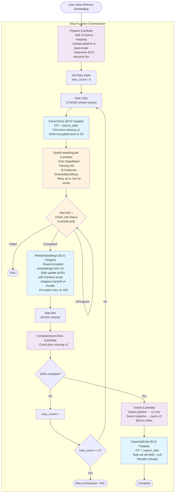
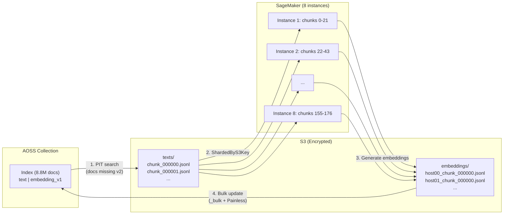

# Refresh Embedding: Dual-Field Reindex with ECS + Lambda Hybrid

## Overview

When a user fine-tunes their embedding model in AOSS, all existing documents still contain embeddings generated by the **old** model. The Refresh Embedding workflow regenerates embeddings for every document using the **new** model, with zero downtime and no impact on concurrent user reads/writes.

This document describes the POC implementation (Option B: ECS for heavy tasks, Lambda for light tasks, Step Function for orchestration).

---

## User Journey

1. User clicks **"Fine-Tune"** in the AOSS console for a semantic field. The model training runs (out of scope for this document).
2. Training completes. User clicks **"Refresh Embedding"**.
3. The system returns a `task_id` immediately. The user can continue reading and writing their index normally.
4. Behind the scenes, the refresh workflow runs for several hours (depending on index size).
5. When complete, the user's search queries automatically use the new embeddings. No action required.
6. The old embedding data is cleaned up to reclaim storage.

**What the user experiences during refresh:**
- Reads: uninterrupted, queries continue on old embeddings until switch
- Writes: uninterrupted, new documents get **both** old and new embeddings (dual-model pipeline)
- After switch: queries use new embeddings, new documents only get new embeddings

---

## Architecture

### Compute Model

| Step | Compute | Why |
|------|---------|-----|
| Prepare | Lambda (~5s) | Simple API calls, no long processing |
| ExtractTexts | **ECS Fargate** (30-60 min) | Long-running, no 15-min Lambda limit |
| StartEmbeddingJob | Lambda (~3s) | Single API call to start SageMaker |
| WaitForEmbeddingJob | Lambda poll (every 60s) | Lightweight status check |
| WriteEmbeddings | **ECS Fargate** (hours) | Long-running, heavy I/O |
| CompletenessCheck | Lambda (~2s) | Two count queries |
| Switch | Lambda (~5s) | Pipeline update API calls |
| CleanOldField | **ECS Fargate** (hours) | Long-running bulk update |

### Workflow Diagram



**Color legend:**
- Purple: Lambda (lightweight, seconds)
- Blue: ECS Fargate (heavy, minutes to hours)
- Orange: SageMaker interaction

---

## Data Flow



---

## Key Design Decisions

### Dual-Model Pipeline (Zero-Downtime Writes)

After `Prepare`, the ingest pipeline generates **both** v1 and v2 embeddings for every new document. This ensures:

- New documents written during the refresh get v2 immediately
- The `must_not exists v2` query in ExtractTexts naturally skips them
- The Painless noop check in WriteEmbeddings avoids overwriting pipeline-generated v2

```
Before Prepare:  pipeline generates v1 only
After Prepare:   pipeline generates v1 AND v2  ← concurrent writes are safe
After Switch:    pipeline generates v2 only
```

### Retry Loop (Guarantees 100% Completion)

WriteEmbeddings may fail on some documents due to AOSS throttling (HTTP 429). Instead of accepting partial completion:

1. `CompletenessCheck` counts docs missing v2
2. If not 100%, the workflow loops back to `ExtractTexts`
3. On retry, only the missing docs are extracted (the query filters by `must_not exists v2`)
4. SageMaker regenerates embeddings for only those docs
5. WriteEmbeddings writes only those docs

Each retry processes exponentially fewer documents. Convergence is fast:

| Round | Docs processed | Typical |
|-------|---------------|---------|
| 1 | 8,840,216 | 99.5% success |
| 2 | ~45,000 | 99.99% success |
| 3 | ~100 | 100% |

### Client-Side Encryption

All data stored on S3 is encrypted with AES-256-GCM before upload:

- **ExtractTexts → S3**: nonce prepended to ciphertext (SageMaker input channel loses S3 metadata)
- **SageMaker → S3**: nonce stored in S3 object metadata
- **WriteEmbeddings ← S3**: reads nonce from S3 metadata, decrypts

POC uses a fixed symmetric key. Production will use KMS `GenerateDataKey`.

### Dynamic ECS Resource Tiering

`Prepare` checks `doc_count` and assigns Fargate resources accordingly:

| Tier | Doc Count | vCPU | Memory | Chunk Size |
|------|-----------|------|--------|------------|
| small | < 1M | 2 | 10 GB | 50,000 |
| medium | 1M - 50M | 4 | 30 GB | 50,000 |
| large | > 50M | 8 | 60 GB | 10,000 |

### Multi-Instance SageMaker (8x Parallelism)

The SageMaker Training Job uses 8 `ml.g5.xlarge` instances with `ShardedByS3Key`:

- SageMaker automatically distributes input chunks across instances
- Each instance processes ~1/8 of the data independently
- Output chunks are namespaced by host index (`host00_`, `host01_`, ...)
- WriteEmbeddings reads all `embeddings/*.jsonl` files regardless of naming

Result: SageMaker phase reduced from ~9h to ~1.5h for 8.8M docs.

---

## Load Test Results (8.8M docs, MS MARCO)

| Phase | Duration | Details |
|-------|----------|---------|
| Prepare | ~5s | Added v2 field, updated pipeline, tier=medium |
| ExtractTexts | ~8 min | 8.84M docs, 177 chunks, 3.3 GB text (encrypted) |
| SageMaker | ~1.5h | 8 instances, gte-base model, 768-dim embeddings |
| WriteEmbeddings | ~11h | 8.84M docs, adaptive backoff on 429s |
| CompletenessCheck | ~2s | 100% complete (with retry loop) |
| Switch | ~5s | Pipelines updated |
| CleanOldField | ~2-3h | Set old embeddings to null |
| **Total** | **~15h** | |

### First Pass vs Retry Comparison

| Metric | Load Test v1 (no retry) | Load Test v2 (with retry) |
|--------|------------------------|--------------------------|
| Completion | 99.49% (45,060 missing) | **100%** |
| Missing docs | 43,453 throttle + 1,607 PIT | **0** |
| SageMaker time | 9h (1 instance) | **1.5h (8 instances)** |

---

## Concurrent Write Safety Analysis

| Scenario | What Happens | Result |
|----------|-------------|--------|
| New doc written after Prepare | Dual-model pipeline generates v1+v2 | v2 exists, ExtractTexts skips it |
| Doc updated during ExtractTexts | Pipeline generates v1+v2 from new text | WriteEmbeddings noops (v2 already exists from pipeline) |
| Doc updated during WriteEmbeddings | Pipeline generates v1+v2 from new text | Painless noop check: v2 exists, skip |
| Doc deleted during WriteEmbeddings | Bulk update returns 404 | Counted as not_found, no error |
| New doc written after Switch | v2-only pipeline generates v2 | Correct |

---

## Error Handling

| Error | Handling |
|-------|---------|
| AOSS throttle (429) in WriteEmbeddings | Per-batch retry (3 attempts) + adaptive backoff + outer retry loop |
| SageMaker quota exceeded | StartEmbeddingJob retries 10x with exponential backoff (60s base) |
| ECS Fargate capacity | Step Function retries with `ECS.AmazonECSException` |
| Lambda throttle | Step Function retries with `Lambda.TooManyRequestsException` |
| PIT expiry during extraction | PIT keep_alive=15m, refreshed on each search call |
| All WriteEmbeddings writes fail (0 success) | ECS task exits 1 → Step Function retry → if persistent, Catch → Failed |
| 5 retry rounds exhausted | RetryExhausted → FAIL (not allowed to switch with incomplete data) |
| CleanOldField partial failure | Non-critical: old data remains but doesn't affect queries |
